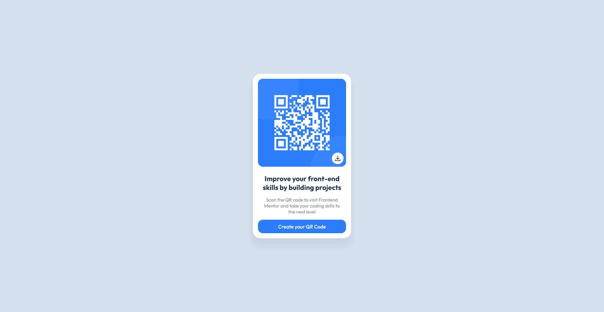

# Frontend Mentor - QR code component solution

This is a solution to the [QR code component challenge on Frontend Mentor](https://www.frontendmentor.io/challenges/qr-code-component-iux_sIO_H). Frontend Mentor challenges help you improve your coding skills by building realistic projects. 

## Table of contents

- [Frontend Mentor - QR code component solution](#frontend-mentor---qr-code-component-solution)
  - [Table of contents](#table-of-contents)
  - [Overview](#overview)
    - [Screenshot](#screenshot)
    - [Links](#links)
  - [My process](#my-process)
    - [Built with](#built-with)
    - [What I learned](#what-i-learned)
    - [Continued development](#continued-development)
    - [Useful resources](#useful-resources)

## Overview

### Screenshot

### Links

- Solution URL: [Add solution URL here](https://your-solution-url.com)
- Live Site URL: [Add live site URL here](https://your-live-site-url.com)

## My process

### Built with

- [Astro](https://astro.build/)
- [React](https://reactjs.org/)

### What I learned

I started this challenge aiming to learn more about Astro, and I think I did it! Astro is really easy and fun to use, and also very fast. 

### Continued development

I didn't want to just do the challenge as it is basic, so I implemented a QR Code generator.

PS: I know there's a small issue with the downloaded QR Code in mobile, but I don't think I'll solve it because it is not my priority now.

### Useful resources

- [Astro Docs](https://docs.astro.build/en/getting-started/)